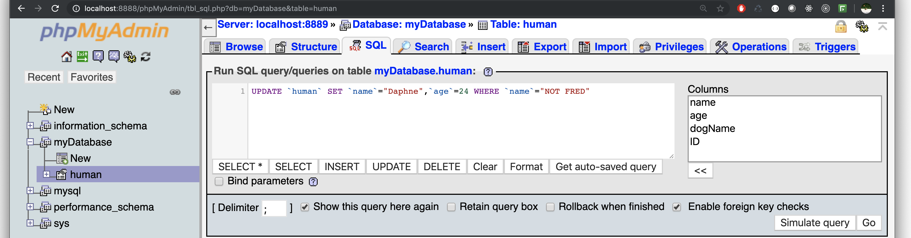

# Databases

Up to now we've been working entirely in front end materials. Databases allow for us to store information pertinant to our sites. There are many different types of databases. The one that we'll be using is a MySQL database. MySQL is an open source **Relational Database** management system (RDBMS). Relational databases store data in columns and rows in a data table, where each row is a given record. Rows among differing tables can also be linked together based on related columns between tables. 


### Installation: 

In order to get a MySQL server running on your own machine, depending on your operating system, you can download either **XAMPP**, [a cross platform server application](https://www.apachefriends.org/index.html) (great for Windows machines), or **MAMP**, [a client for macOS.](https://www.mamp.info/en/) Follow the download/installation instructions. 

After installing, open the application and start your server. Make sure that apache and mySql are running. 


### MySQL

In order to access our database, we'll need either to access our database via the command line,  download software for interfacing with our server (such as [MySQL Workbench](https://www.mysql.com/products/workbench/)), or use the already provided phpMyAdmin. For the sake of not having to download any more software, we'll be using phpMyAdmin. 


After you start your xampp or mamp server, a start page should open automatically. If it did not, try going to either localhost:8080, or if you're running mamp, try localhost:8888. To reach phpMyAdmin, you can either follow the links on your server page (top right on xampp or scroll down for mamp) and click on phpMyAdmin, or you can add `/phpMyAdmin` after your localhost with the port number to access phpMyAdmin.  You should find yourself on a page like this: 


#### Creating a Database: 

In order to create a database, we need to create a database name and ensure we have the right encoding: 


After hitting the create button, you should find yourself on a page noting that you have no tables. You should also notice your databse name on the left hand file structure: 


#### Creating a Table: 

To create a table, you need only to fill in a name for the table as well as the number of columns for the table: 

Once you've created a column, you should find yourself on a new page with containers for each column:


To fill in each column, we need to ensure at the very least two things: 

- Column Name
- Datatype

Unlike javascript, MySQL is strongly typed. So choose wisely! A significant amount of possible datatypes are available. We will use INT and TEXT. Let's create a table for humans: 


Note that if you click the `Preview SQL` button in the bottom right, you can then what SQL code is actually being executed in the background: 


After clicking save, you'll come to a page that looks something like this: 


#### Inserting New Data into Tables: 

There are a number of ways to insert data. If you click on the `insert` tab, you'll come across this page: 


This page is a GUI wrapper for inserting data to our table. Enter the data desired in the fields, and then click the "GO" button: 


After you've inserted a row, you'll be taken back to the SQL page with the SQL Code that was just executed in the SQL code region.  Note that the code has already been executed. 


Try adding a few names of your own! 


### Querying the Databse: SELECT, INSERT, UPDATE, DELETE 

We've already seen a bit of SQL code from what the GUI has formatted for us, but to better understand how SQL queries work, we'll need to actually work with the code! 

SQL commands typically follow the syntax of: 

```mysql
SELECT something FROM tableName WHERE someTruthCondition
```


Let's take a look. Let's try to select literally everything from our human table: 

```mysql
SELECT * FROM `human` WHERE 1;
```


What this evaluates to is "Select all columns from the human table". The `WHERE 1` is a boolean value that will return true for every single row (note: the additional names were added, but not included in these notes). 


Suppose we wanted to get values that followed some condition. We can include that in our query: 

```mysql
SELECT * FROM `human` WHERE `age` > 26;
```

By adding the "\`age\` > 26" condition, we're only receiving one row, the Steve row, instead of all three.


You can also query on specific equalities: 

```mysql
SELECT * FROM `human` WHERE `name`="Shaggy"; 
```


By searching for a specific string, you can narrow down potential answers almost immediately. 


#### Inserting Data: 

There will most definetely be a time where you'll have to programatically enter data to your database. In order to do so, you will need to know how to write insert queries. We've inserted data already through the insert tab, but let's take a look at the basic syntax for inserting data via `SQL` queries: 

```mysql
INSERT INTO tableName (columnName1, columnName2, columnName3) VALUES ("dataForColumn1", "dataForColumn2", "dataForColumn3")
```

Let's take a look at a real query. If you click the `SQL` tab, and then click the `insert` button, a sql template for inserting data will appear: 


Change the `[value-#]`s to actual values corresponding with their columns: 


Adding multiple values, we can get: 


Now that we've inserted data to our table, the table should look something like: 


#### Updating Data: 

It's not always the case that data will stay the same. Usernames change. Passwords change. Ages change. Many things change! 

In order to change data, we need to follow the syntax: 

```mysql
UPDATE `tableName` SET `columnName1`= 'newColumnValue' WHERE `condition`
```

So, in an example where we want to change the name "Me" to something more useful, such as a name, like "Matt", we can update  our human table, set name to matt, and update that name only where there is a dog named marly: 


After executing the above code, we'll see that the column with "Me" and "Marly" the dog has changed to a row with Matt and Marly: 


One quick note is that if you're attempting to update a row, make absolutely sure you're using the `WHERE` properly. Suppose we forgot to make our column IDs unique when inserting data. Let's see what would happen if we tried to update a row based on a non-unique ID: 


Because we did not make our IDs unique, we inadvertantly had 2 of the same IDs: 


So, let's go and change our name and ID: 


So, now we have`NOT FRED` with an ID of `8`: 


### Having a Primary Key / Unique ID: 

Before we go any further, we need to set a primary key so that we don't wind up accidentally overwriting other rows.


 Click onto the structure tab, and then click the `more` section of the `ID` row,  and select `Primary`:


By selecting a primary key, we establish that there will be entirely unique IDs for each and every row. 

So, now if we try to add someone to our table with the same ID as an already existing user, we'll get an error: 


#### Updating multiple column values: 

Back to updating, it's not always the case that you'll want to update only a single column in a row. It's most likely the case that you'll want to update multiple columns at a given point in time. Now that we have `NOT FRED`, let's try updating everything about that row: 


So now our database has a whole slew of names, ages, dogs, etc: 


### Deleting Data: 

It's likely the case that you'll need to delete a row (or multiple) at some point in time. To delete data in mysql, you'll need to follow the syntax: 

```mysql
DELETE FROM `tableName` WHERE `condition`
```


Suppose we wanted to get rid of the row that contained a dog named Fido, in practice, that looks like: 


In phpMyAdmin, when you're deleting code, you'll be prompted by the UI. That's very thoughtful of the UI creators, however, that's not the case for deleting rows programatically.  The Prompt looks like: 


The database now no longer has a row with a dog named fido: 


**NOTE**: when deleting, make sure your conditions are specific. If your condition were `1` or something of the sort, you'd wind up deleting the entire database. 


## Multiple Tables: 

Selecting, Inserting, Updating, and Deleting are all well and good, but none of those really show where the true power of a relational database lies: Table joining. 

Splitting data up to make sure we're not storing any redundant material is absolutely necessary with greater and greater databases. However, relationships are not always one to one. Sometimes, they're one to many relationships (like one human having many dogs for pets), or possibly even many to many (such as shared ownership of multiple dogs).  Storing a row for each specific instance of these relationships can become extremely frustrating, so it's easier to just store the individual data and join on specific keys. 

Before we get into talking about joining tables, we need a second table to begin with. Go to phpMyAdmin and create a new table. We'll call this one dog: 


After creating the table, we can add data in: 


Now that we've created a second table, there is a redundancy between the two tables. We are storing dogName twice. Once in the human table, under dogName, and once under the dog table as name. While it is reasonable to try to join our two tables on dog name, thinking about the data for a minute might be worthwhile. Many dogs likely have the same name, and that could lead to us matching data incorrectly. Instead, if we match on ID number, it's extremly unlikely that we'll mismatch anything. 


Since that is the case, then, we can delete dogName from our human database: 

The query itself looks like the below code: 


Now we no longer have redundant code! 


#### Joining Tables 

There are a number of different types of joins among database tables, however we won't be discussing the differing types of joins for now. The basic syntax of a join goes something like: 

```mysql
SELECT `table1`.`columnName1` `table2`.`columnName2` `table`.`columnName3` FROM `table1` JOIN `table2` ON `equalityStatement` WHERE `condition`
```

To join both our human and dog tables, we just need to join on the human's ID as well as the dog's humanID. 


The data returned were both from the `human` and the `dog` tables! The only downside to this is that the columns are all named exactly what they are in their own database.  


Additionally, you can also search with a specific search parameter in place: 


By adding the conditional, the only joined dog owners and dogs that we'll see are those all older than 25 (all of the humans, at least): 


A downside is that it is entirely possible to have data columns with the same name among the tables. However, this is fixible! We can easily fix this problem by using the `as` keyword! By adding an `as` after the column, you can completely rename it: 


Now we return an entirely different series of data, each with their own specific and unique column! 


